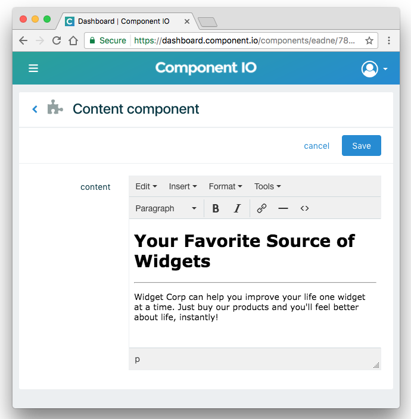

# Tutorial: Add content with a web component

*This tutorial takes 5-10 minutes.*

In this tutorial you will use a web component to render content on a webpage. Once the component is in place, you'll be able to edit the content without touching your code.

### [Demo here](http://tutorial-content-component.us-east-1.elasticbeanstalk.com/)

## Getting Started

There are 2 ways to view the file: by downloading or by cloning this repository.

#### Option A: direct download

Download the code as a .zip file using the above [](#) button. Unzip the package and view the web page by opening `index.html` with your browser.

#### Option B: `git clone` and run with node

* In your terminal window, run
```
git clone https://github.com/jframedev/tutorial-content-component.git
cd tutorial-content-component
npm install
npm start
```
* Visit `http://localhost:3000` in your browser

## The web page

We have a basic landing page that needs some content to describe the main product.

[](http://tutorial-content-component.us-east-1.elasticbeanstalk.com/)

We could simply hard-code a description, but this is a great example of where the marketing team or a client might want to make changes later. So instead, we can use a jframe content component, which will make it easy to change the content later if we want.

Find the heading in line 74 of `index.html`

```html
<h1>Lorem ipsum</h1>
```
and replace it with the following
```html
<jframe content id="wnqag"></jframe>
```

This jframe already has some content we can use. If you want to create your own jframe with your own content, you can [sign up for an account and create your own](https://jframe.io/auth/signup).

With the jframe component in place, we just need to paste the jframe script onto the page. On line 263 of `index.html`, paste the script:

```js
<!-- jframe script -->
<script src="https://cdn.jframe.io/jframe.js" project="PROJECT-ID"></script>
```

Now when you reload the page, you get the content from the jframe.

[](http://tutorial-content-component.us-east-1.elasticbeanstalk.com/)

It's that simple -- your component is working, and you can now edit its content in the jframe dashboard.

[](https://jframe.io/)

You've separated the content from the code, and any changes to the content can now be managed through jframe's online dashboard by anyone on the team.

Sign up to create your own component and edit it with the dashboard.

[](https://jframe.io/auth/signup)

## Extra: behind the scenes

When the jframe script runs, it changes the jframe component from

```html
<jframe content id="wnqag"></jframe>
```
to
```html
<div jframe content id="wnqag">
  <h1>Your Favorite Source of Widgets</h1>
  <hr>
  <p>Widget Corp can help you improve your life one widget at a time. Just buy our products and you'll feel better about life, instantly!</p>
</div>
```
And because it's ultimately just HTML, you can style it however you want.

## Other

#### Credit where it's due

This project is based on [Start Bootstrap](https://startbootstrap.com/template-overviews/creative/), which is based on the [Bootstrap](http://getbootstrap.com/) framework.

#### Bugs and Issues

Have a bug or an issue with this template? [Open a new issue](/issues) here on GitHub.

#### Copyright and License

Copyright 2017 jframe. Code released under the [MIT](/LICENSE) license.
